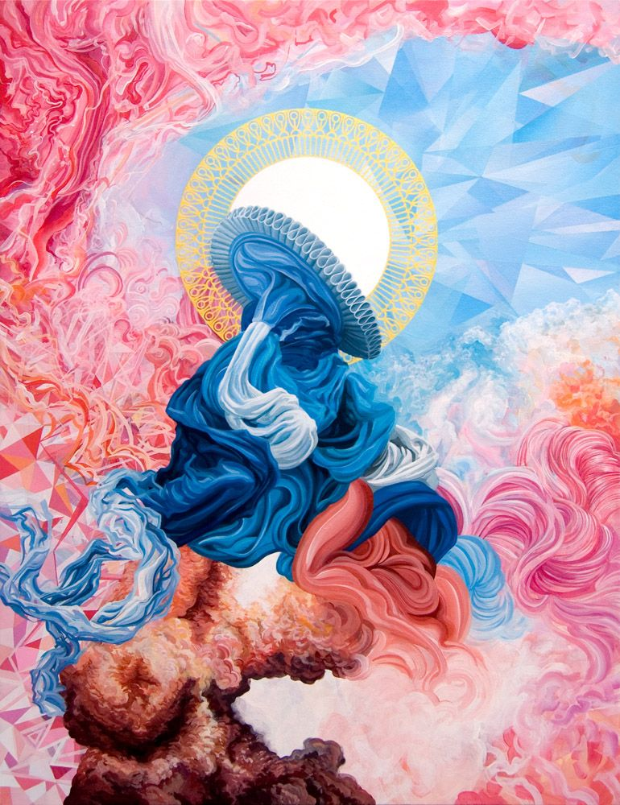
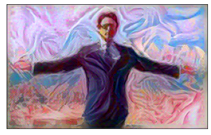
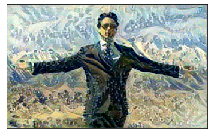

# Neural_Style_Transfer
Implementing NST using Tensorflow

This is my implementation of the paper, **A Neural Algorithm of Artistic Style** ---- [link](https://arxiv.org/abs/1508.06576)

## Overview

Neural style transfer involves the transfer of a style of an image to another image. The other image is termed "content image" while the image from which we acquire the artistic style is called the "style image".

I have used VGG19 as my baseline model. The features required to obtain the style and content from correspoding images have been obtained from the convolutional layers present in this model. To learn in depth about Neural Style Transfer, take a look at the link above.

Both PyTorch and TensorFlow implementation are available and can be used as required.

## Results Obtained
### Content Image

### Style Images
      

### Generated Images
        

If you have any queries, feel free to ask them. I'll do my best to answer. :)

Happy Learning People ! Keep chasing your dreams ! ⭐️

## References
1) Leon A. Gatys, Alexander S. Ecker, Matthias Bethge (2015). [A Neural Algorithm of Artistic Style](https://arxiv.org/abs/1508.06576). arXiv preprint arXiv:1508.06576

2) [Image Style Transfer Using Convolutional Neural Networks](https://www.cv-foundation.org/openaccess/content_cvpr_2016/papers/Gatys_Image_Style_Transfer_CVPR_2016_paper.pdf)
